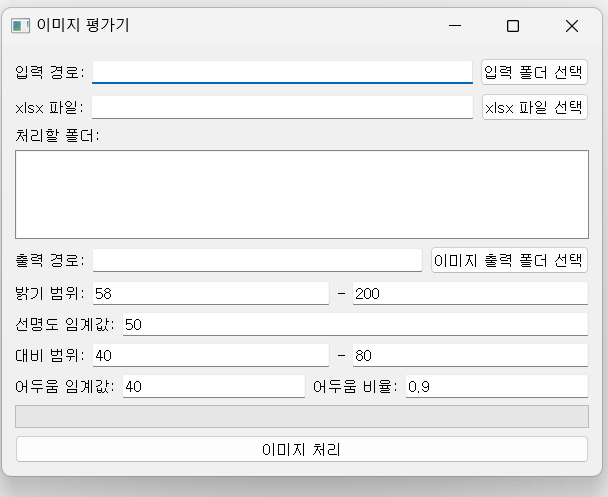
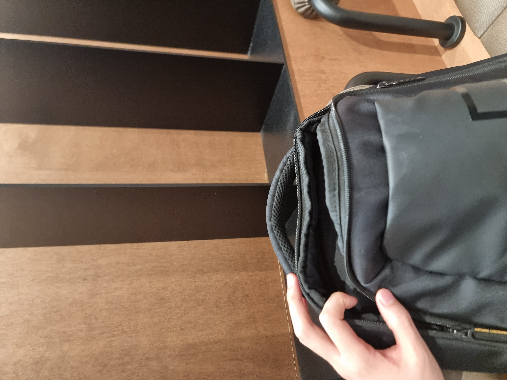
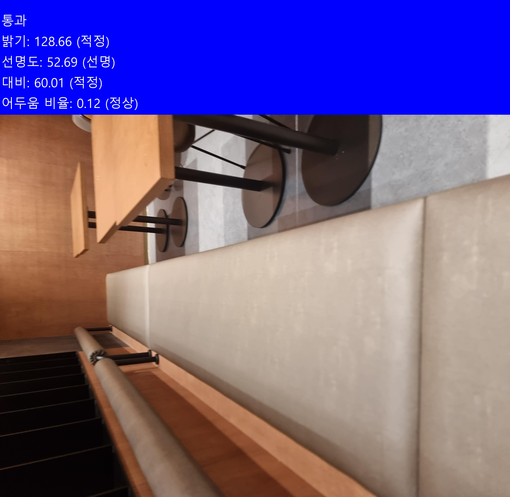
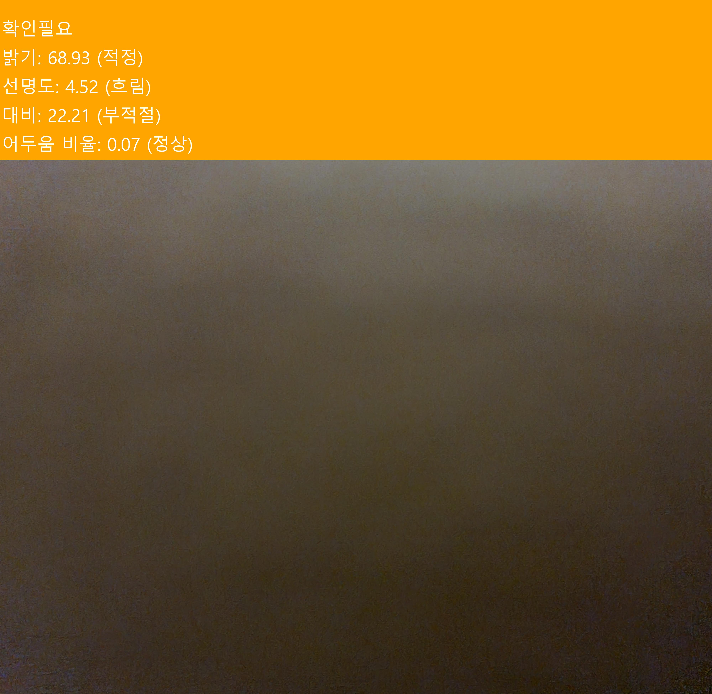
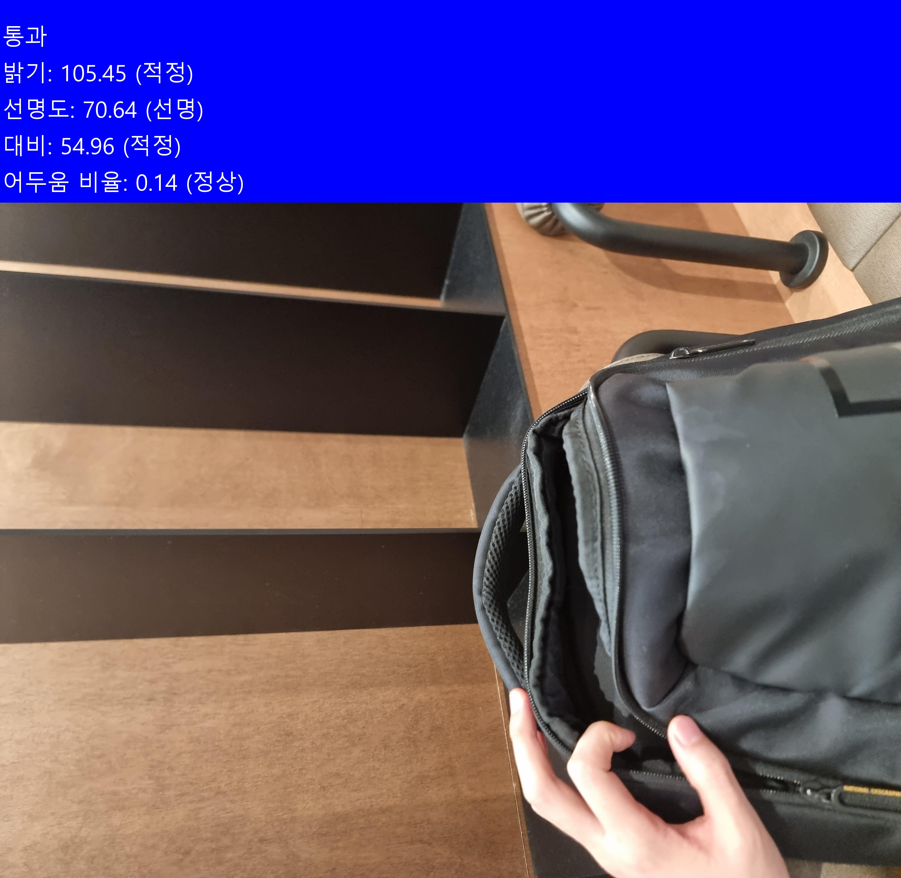

# Image Quality Evaluator

Image Quality Evaluator는 이미지 품질을 자동으로 평가하는 Python 기반 GUI 애플리케이션입니다. 이 다재다능한 도구는 다음과 같은 주요 기능을 제공합니다:

image_quality_evaluator_gui.py 는  gui 버전
image_quality_evaluator.py 단순 파이썬 실행용.

## 주요 기능
- 이미지의 밝기, 선명도, 대비, 전체적인 어두움을 정밀하게 분석
- 직관적인 GUI를 통한 입력/출력 폴더 선택 및 평가 기준 조정
- 처리된 이미지에 시각적 평가 결과 표시
- 선택적 Excel 보고서에 내용 추가 기능 (필요시 활용 가능, 없어도 실행가능)

사용자 친화적인 인터페이스로 설계되어 있어, Excel 파일 입력 없이도 이미지만으로 완벽하게 작동합니다. 
이는 사용자에게 더 큰 유연성을 제공합니다.

GPT나 Claude와 같은 AI 도구를 활용한 코드 커스터마이징도 가능합니다. 


## 사용 방법 예시

(image_quality_evaluator_gui.py 예시)
[ Excel 파일 입력 없이도 이미지만으로 완벽하게 작동]
## 설치
```
pip install opencv-python
pip install numpy
pip install pandas
pip install openpyxl
pip install Pillow
pip install PyQt5
```

### 입력 폴더 구조
입력 폴더는 다음과 같은 구조를 가질 수 있습니다:

```
C:\Users\leeis\OneDrive\바탕 화면\code\check
└── 20240627
    ├── 1101568693
    │   ├── image1.jpg
    │   └── image2.png
    ├── 1101568692
    │   ├── image3.jpg
    │   └── image4.png
    └── 1101568691
        ├── image5.jpg
        └── image6.png
```

이 경우, 사용자는 '20240627' 폴더를 입력 폴더로 선택합니다. 프로그램은 자동으로 그 아래의 모든 하위 폴더(1101568693, 1101568692, 1101568691 등)를 탐색하여 이미지를 처리합니다.

### 출력 폴더 구조
사용자가 출력 폴더를 선택하면, 프로그램은 입력 폴더의 구조를 그대로 유지하면서 평가된 이미지를 저장합니다. 예를 들어:

```
D:\평가된_이미지
└── 20240627
├── 1101568693
│   ├── evaluated_image1.jpg
│   └── evaluated_image2.png
├── 1101568692
│   ├── evaluated_image3.jpg
│   └── evaluated_image4.png
└── 1101568691
├── evaluated_image5.jpg
└── evaluated_image6.png
```

이렇게 함으로써 사용자는 원본 이미지와 평가된 이미지를 쉽게 비교할 수 있습니다.

사용자 친화적인 인터페이스로 설계되어 있어, 기술적 배경이 없는 사용자도 쉽게 사용할 수 있습니다. 또한, 고급 사용자를 위해 GPT나 Claude와 같은 AI 도구를 활용한 코드 커스터마이징도 가능합니다.

# 예시 이미지




# 출력 이미지



